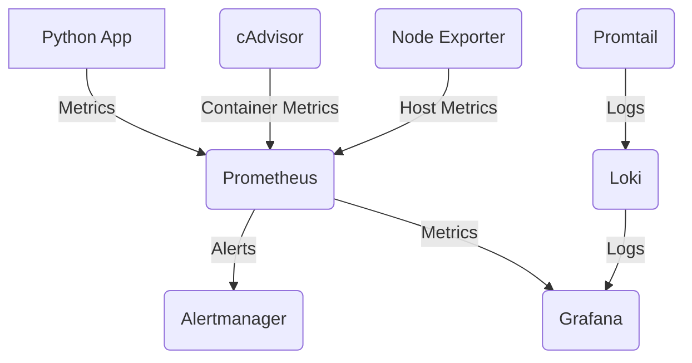

# monitoring-with-docker-compose

```markdown
# Python App with Docker Monitoring Stack


A production-ready Python application with comprehensive monitoring using:

- **Prometheus** - Metrics collection
- **Grafana** - Visualization & dashboards
- **Loki + Promtail** - Log aggregation
- **Alertmanager** - Alert routing
- **cAdvisor** - Container metrics
- **Node Exporter** - Host system metrics

## 📦 Architecture Overview



## 🚀 Quick Start

```bash
# Start the full stack
docker compose up -d

# Access services:
# - App:         http://localhost:5000
# - Grafana:      http://localhost:3000  (admin/admin123)
# - Prometheus:   http://localhost:9090
# - Alertmanager: http://localhost:9093
# - cAdvisor:     http://localhost:8080
```

## 🔍 Monitoring Components

### 📈 Metrics Collection
| Component          | Purpose                          | Access URL              |
|--------------------|----------------------------------|-------------------------|
| **Prometheus**     | Central metrics database         | http://localhost:9090   |
| **cAdvisor**       | Container resource usage         | http://localhost:8080   |
| **Node Exporter**  | Host machine metrics             | http://localhost:9100   |

### 📜 Log Management
| Component          | Purpose                          |
|--------------------|----------------------------------|
| **Loki**           | Log aggregation system           |
| **Promtail**       | Log collector for Docker         |

### ⚠️ Alerting
Pre-configured alerts in `monitoring/alertmanager/config.yml`:
- High CPU usage (>80% for 5m)
- High memory usage
- Container down
- High error rate

## 🛠️ Maintenance Commands

```bash
# Check Promtail logs
docker compose logs -f promtail

# Verify Node Exporter metrics
curl http://localhost:9100/metrics | grep 'node_memory_'

# Check cAdvisor targets in Prometheus
open http://localhost:9090/targets?search=cadvisor
```

## 📊 Sample Grafana Dashboards
1. **Docker Monitoring** - ID 193
2. **Node Exporter Full** - ID 1860
3. **Loki Logs** - ID 13639

Import these via Grafana UI using the dashboard IDs.

## 🔧 Troubleshooting

**No logs in Loki?**
```bash
# Verify Promtail is scraping
docker compose exec promtail wget -qO- localhost:9080/targets
```

**Missing host metrics?**
```bash
# Check Node Exporter
curl -s http://localhost:9100/metrics | head
```

## 📜 License
© TWUM GILBERT
